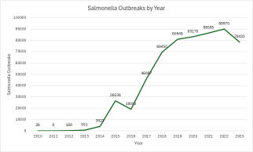
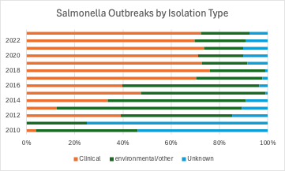
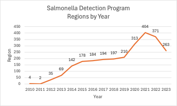
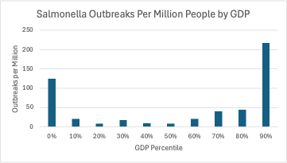
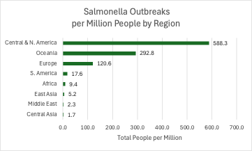

# Salmonella Data Story
## Framework

Salmonella is a disease that causes diarrhea and stomach pains \[1\]. It is a very common disease and is the United States is the most common bacterial food poisoning. People are more likely to get salmonella if they work with animals such as chickens and ducks, recently took antibiotics or already have inflammatory bowel disease.

Salmonella is common across the world \[2\]. A salmonella outbreak dataset from Kaggle contains insights about this disease. This dataset includes information about different salmonella genome outbreaks across the world, including where they were detected. Nations with more resources may be able to more effectively detect new outbreaks.

To provide context for the different countries, each country's population and Gross Domestic Product (GDP) was analyzed as well \[3,4\].

## Key Points

The number of salmonella outbreaks has increased over time (The 2023 data is multiplied by 3/2 since it only covers the first 2/3 of the year). This may be due to improved detection of outbreaks. Up until 2015, a minimal number of outbreaks were detected. This is likely due to a limited rollout of the system.

## Insight

This salmonella detection program was initially only used in 4 regions. Over time the number of regions the program was used in expanded. In 2021, the program encompassed 404 unique regions. After this point the number of regions decreased until it reached its current count of 263 regions.

Salmonella outbreaks are most often detected in nations with low and high GDPs. The average outbreaks per million people are the greatest in the lowest 10 percent and the highest 10 percent.

The highest detected number of outbreaks per million people are in Central and North America, Oceania and Europe. The lowest detected number of average outbreaks per million people are in Central Asia, the Middle East and East Asia.

There is also a strong correlation between GDP and salmonella outbreaks (0.83) while there is a weak correlation between population and salmonella outbreaks (0.16). Wealthier nations may be better at detecting salmonella outbreaks or may simply have more salmonella outbreaks.

## Conclusion

Salmonella is a relatively common disease. The number of salmonella outbreaks detected increased as the scanned regions increased. Salmonella tends to be detected in nations that are wealthy and in nations that are not well off. North America and central America are the most common regions for salmonella outbreaks. This detection system is helpful for tracking Salmonella.

## Works Cited

- <https://my.clevelandclinic.org/health/diseases/15697-salmonella>
- <https://www.kaggle.com/datasets/imtkaggleteam/pathogen-detection-salmonella-enterica>
- <https://www.kaggle.com/datasets/sujaykapadnis/world-population-2023-countrywise>
- [https://en.wikipedia.org/wiki/List*of_countries_by_GDP*(nominal)](https://en.wikipedia.org/wiki/List_of_countries_by_GDP_%28nominal%29)
